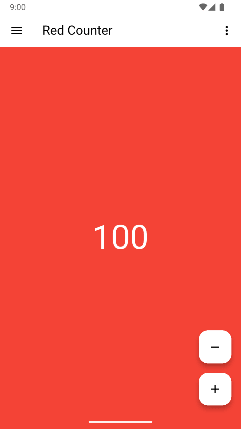
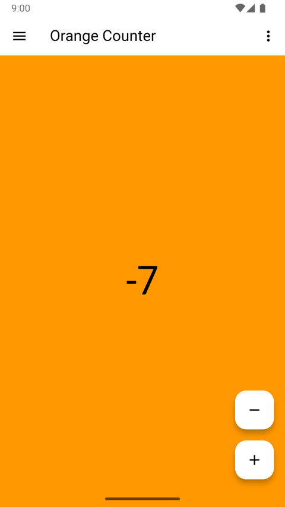
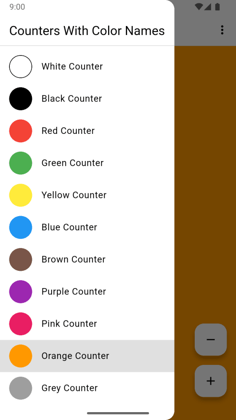

> [!NOTE]
> **This `counters_with_color_names` branch contains the legacy "Counters With Color Names" project.**
>
> This branch holds the legacy "Counters With Color Names" project source. The actively maintained successor project, renamed "Hello World Counters", is in the repository's `main` branch:
> https://github.com/TheHelloWorldWriter/hello_world_counters/tree/main

# Counters With Color Names

**Counters With Color Names** is a simple and discreet tally counter app built with Flutter for Android and the Web (PWA).

The app provides eleven distinct counters, each corresponding to one of the basic English color terms (Red, Green, Blue, etc.). This unique design allows you to track multiple items simultaneously without anyone knowing what you're counting.

### Core features

- **11 Color-Coded Counters:** Keep track of multiple tallies at once.
- **Simple Controls:** Easily increment, decrement, and reset each counter.
- **Share Functionality:** Share your counts via email, messengers, or social networks.

### About this project

Counters With Color Names is one of my first Hello World apps made with Flutter. 

[Hello World programs](https://en.wikipedia.org/wiki/%22Hello,_World!%22_program) are pretty famous, even if all they do is write "Hello, World!" on the screen. When learning a new programming language or platform, starting with such a simple program has become a tradition.

[Flutter](https://flutter.dev) is an open source framework for building beautiful, natively compiled, multi-platform applications from a single codebase.

## Screenshots

  

## Try Counters With Color Names

* **On Android:** Get it from [GitHub Releases](https://github.com/TheHelloWorldWriter/hello_world_counters/releases).
* **On any platform:** [Run the web app](https://helloworldcounters.thehelloworldwriter.com/) and/or install it from your browser on Android, ChromeOS, iOS, Linux, macOS, Windows, etc.

## Contributing

Thank you for contributing! Counters With Color Names is designed to be as simple and useless as possible, but you can still help with:

* testing and reporting bugs
* creating a nice icon to replace the [current one](web/icons/Icon-512.png)

## License

Counters With Color Names is released under the [MIT License](/LICENSE).
